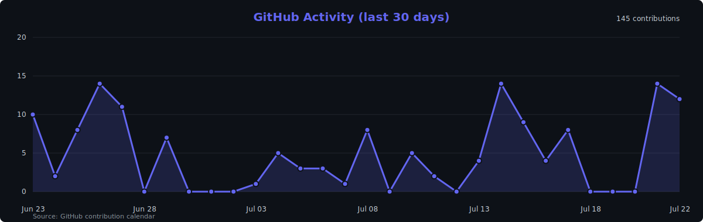
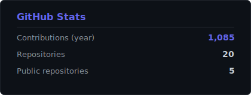
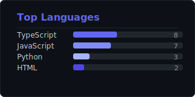

  

<h1 align="center">Chady Kassab</h1>

  <b>Full-stack software engineer</b> · Open to software engineering roles 
  Founder of <a href="https://exosites.ch/eng/">Exosites Studio</a> · Geneva · Swiss citizen 
  <a href="https://exosites.ch/eng/">exosites.ch</a> ·
  <a href="https://www.linkedin.com/in/chady-kassab/?locale=en">LinkedIn</a> ·
  <a href="mailto:studio@exosites.com">studio@exosites.com</a>

---

### Featured projects

| Project | Outcome |
|:--------|:--------|
| **[EXO](https://github.com/Chadoud/exo)** | Cross-platform AI desktop app — sort, second brain, assistant · [Download](https://exosites.ch/downloads/exo-assistant/) · [Case study](https://exosites.ch/eng/projects/exo-ai) |
| **[Clear Aligner Production CRM](https://github.com/Chadoud/clear-aligner-production-crm)** | Public CRM template for aligner labs — cases, quotes, invoicing, doctor billing |
| **[PiGuard](https://github.com/Chadoud/piguard-raspberry-pi)** | Raspberry Pi vision prototype → Telegram alerts |

[SwissAligner](https://exosites.ch/eng/projects/swissaligner) — private client ERP (production), separate from the public CRM template.

---

  

  
  

